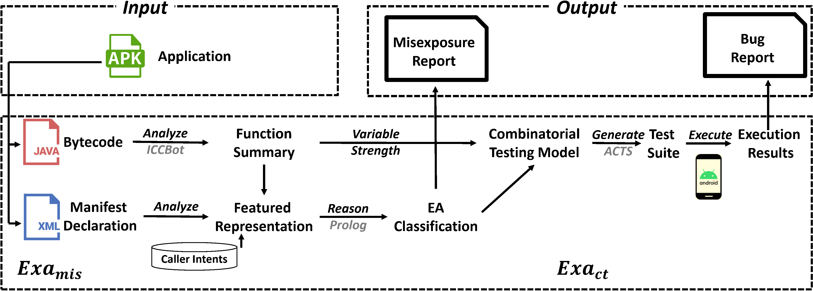

# ExaDroid  

This artifact is for the paper "Variable-Strength Combinatorial Testing of Exported Activities Based on Misexposure Prediction".



ExaDroid is designed to find robustness issues in exported activities (EA) in Android apps, which extracts function summaries of EAs, identifies misexported activities, and uses combinatorial testing to generate tests.

## Structure

- ExaDroid
  - **benchmark**: Adopted benchmark (BenchFdroid), available from [Google Drive](https://drive.google.com/drive/folders/1i2ETA4xBaxpSFORvA95ylATOgcuPv4XJ?usp=share_link)
  - **libs**: Tools adpoted in this work
    - android-1: Android platform library
    - ICCBot: [ICCBot](https://github.com/hanada31/ICCBot/tree/8d85a0cad5d03380430165f1107a59d257cb8d17) adopted by ExaDroid
    - AACT.jar: Android Application Component Tester (independent jar)
    - AACT-Test-Bridge.apk: Android Application Component Tester Bridge (should be install on Android device)
    - adb.exe: Android Debug Bridge (for Windows)
    - AdbWinApi.dll: Android Debug Bridge Windows API
    - AdbWinUsbApi.dll: Android Debug Bridge Windows USB API
    - apktool_2.3.1.jar: APKTool adpoted by Mist
    - IntentFuzzer.apk: Comparation tool (related work)
    - Mist.jar: Mist tool (independent jar)
    - MistResultAnalyzer.jar: Mist result analyzer (independent jar)
  - **result**: Data of experiment result
    - FICs: Manual analysis result of Failure-inducing interaction
    - ICCResults: Static analysis result from ICCBot (packed in zip format)
    - MisexposurePredictions: Result of mis-exposure prediction from Mist
    - RelatedWorkResults: Result from related works (including [Fax](https://github.com/hanada31/Fax) and [IntentFuzzer](https://github.com/MindMac/IntentFuzzer))
    - TestcasesGenerated: Testcases geneerated by AACT (with [ACTS](https://csrc.nist.rip/groups/SNS/acts/documents/comparison-report.html) combinatorial testing model)
    - TestExecutionResult: Dynamic execution result of generated testcases
  - **scripts**: Script to run ExaDroid
  
## Requirements

- Install Java (both 8 and 17)
- Install Android SDK Tools (lower than 25.2.3)
- Install Python
- Install swi-prolog

- For dynamical testing, please install an emulator or connect with an Android device
  - Currently only supports running on Android systems signed by AOSP original test-key

## Usage of ExaDroid

- Prepare an Android device or emulator (signed with AOSP original test-key) and connect it to you computer. Turn the setting item "Developer mode" on and allow "USB Debugging".  

- Clone the project to your computer (submodules are not required).

- Follow the next steps

### Static analysis

- Run the following command in console under ExaDroid root directory

```sh
# Get static analysis result
python scripts/GetFunctionSummary.py <input-apk-dir> [<output-icc-result-dir>]

# Get mis-exposure prediction result
python scripts/GetMisexposurePrediction.py <input-apk-dir> [<output-mist-result-dir>]
```

Details are discribed as follow.

- Assume that all APKs for testing is located under `<input-apk-dir>`.
- Default value of `<output-icc-result-dir>` is `/path/to/ExaDroid/result/ICCResult`.
- Default value of `<output-mist-result-dir>` is `/path/to/ExaDroid/result/MistResult`.
- After running two scripts, the static analysis result will be in `<output-icc-result-dir>` (ICCBot analysis result) and `<output-mist-result-dir>` (Mist analysis result).
- Directory `<output-icc-result-dir>` stores the ICC analysis resutls of each app.
  - Exported Activities' function summaries are saved as two files:
    - file "paramSummary.json" at `<output-icc-result-dir>/<apk_name>/ICCSpecification` stores intent-dependent paths
    - file "ComponentModel.json" at `<output-icc-result-dir>/<apk_name>/ICCSpecification` stores intent structures and candidate values of intent attributes
- **TIPS**: Misexposure prediction requires Java 8
- About user-specified command-line arguments:
  - Users can set the `max running time` and `max number of paths` within `scripts/config.py`.
  - Users can adjust the `misexposure classification conditions` and the `priority of rules` within `scripts/EAClassifier.pl`.
  - We are reimplementing `MistResultAnalyzer.jar` to enable users to also configure the thresholds of rules.

### Test Generation

- Run the following command in console under ExaDroid root directory

```sh
# Generate testcases by AACT
python scripts/GenerateTestCases.py <input-apk-dir> [<input-icc-result-dir>] [<input-mist-result-dir>] [<output-testcase-dir>]
```

Details are discribed as follow.

- Assume that all APKs for testing is located under `<input-apk-dir>`, and the static analysis results are located in `<input-icc-result-dir>` and `<input-mist-result-dir>`.
- After running the script `GenerateTestCases.py`, the generated testcases can be found in `<output-testcase-dir>`.
- Each suite of testcases of an EA is saved as an CSV file under `<output-testcase-dir>/<apk-name>`, where each column is an parameter and each row is an assignment to all the parameters, i.e., a test case.
- The combinatorial-testing models are saved in `<output-testcase-dir>/CTModels.log`.
- About user-specified command-line arguments:
  - Test generation allows configurations including but not limited to `random seed`, `value-taking strategies` and `combinatorial strength`, etc. Please refer to [AACT README](https://github.com/LightningRS/AACT/README.md) for details.

### Test Execution

- Run the following command in console under ExaDroid root directory

```sh
# Execute all testcases on Android device
python scripts/ExecuteTestCases.py <input-apk-dir> [<input-icc-result-dir>] [<input-mist-result-dir>] [<input-testcases-dir>] [<output-result-dir>]

# (Optional) Analyze result
python scripts/AnalyzeResult.py <input-apk-dir> [<input-icc-result-dir>] [<input-mist-result-dir>] [<input-testcases-dir>] [<input-result-dir>]
```

Details are discribed as follow.

- Assume that all APKs for testing is located under `<input-apk-dir>`, and the generated testcases are located in `<input-testcase-dir>`.
- When running the script `ExecuteTestCases.py`, the APK will be installed on the device automatically, and all EAs will be launched for multiple times according to the testcases.
- After running the script, the test execution result can be found in `<output-execution-result-dir>`.
  - The test results can be analyzed by consulting the log file under `<output-execution-result-dir>/logs`.
  - Users can run `AnalyzeResult.py` to do further analysis, including but not limited to attach the test execution results to the test suite table for root cause analysis.

### Detect Crashes

```sh
python scripts/FindCrashes.py <input-apk-dir> [<input-icc-result-dir>] [<input-mist-result-dir>] [<input-testcases-dir>] [<input-result-dir>]
```

- The unique error-level stack traces can be found in `<output-crash-result-dir>/UniqueErrors.txt`.
- We have already included the FICs we identified in the paper under `/result/FICs`.
